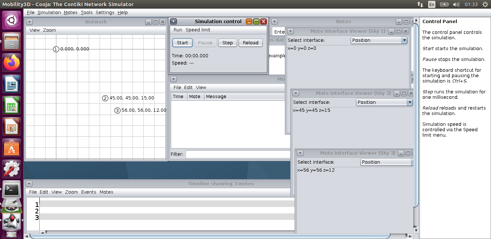
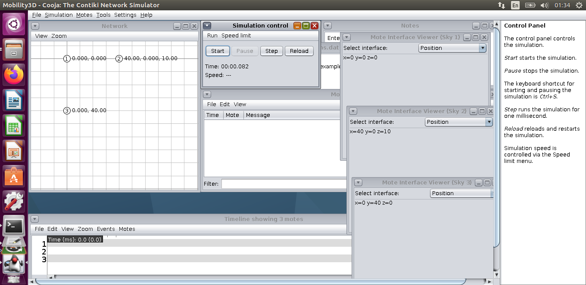
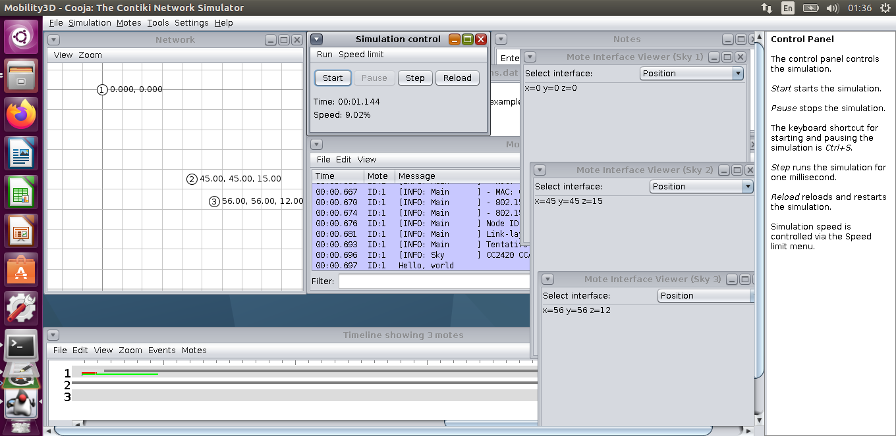

### 3D Mobility in Cooja ###

- **[Importing the mobility plugin to Cooja](https://github.com/NETSERV-UAH/IoTorii/tree/master/Contiki-ng_4_2/Mobility)**
- **Customizing the plugin to support 3D Mobility:** Navigate the current directory to ~/contiki-ng/tools/cooja/apps/mobility/java/ and replace the new [Mobility.java](https://github.com/NETSERV-UAH/Tools/blob/master/Contiki_NG/3D_Topology/Mobility3D/Changes/Mobility.java
) with the existing Mobility.java. 

Navigate the current directory to ~/contiki-ng/tools/cooja/apps/mobility/.

> If you built the project before updating the changes, it is better to clean it:
```bash
sudo ant clean
```

> Built the project:
```bash
sudo ant jar
```

- Attachments



